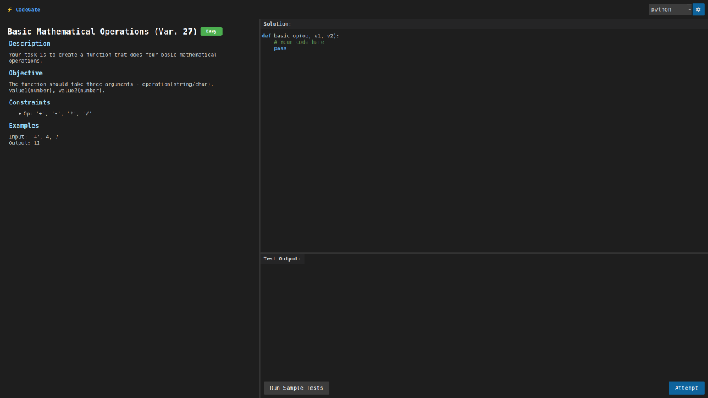
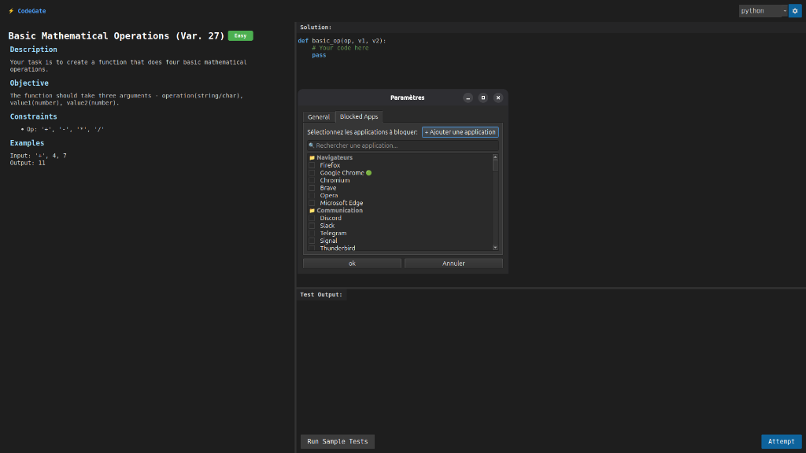
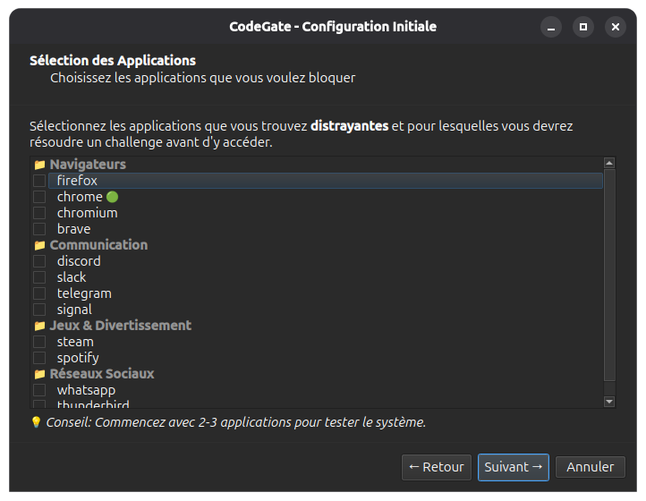
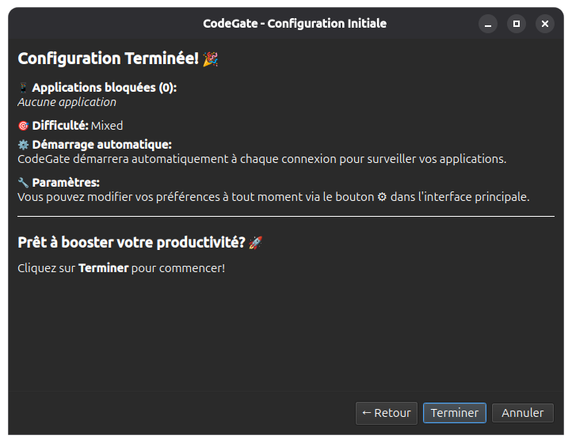

# CodeGate

**CodeGate** is an innovative Linux productivity tool that blocks your distracting applications and forces you to solve a coding challenge to access them.

> 🎯 **Goal**: Improve your personal discipline while boosting your programming skills.



---

## Features

### 🔒 Smart Blocking

* Continuous monitoring of configured applications
* Instant blocking via `SIGSTOP` (without killing the app)
* Fast detection (0.3s) to intercept launches
* Anti-bypass protection with watchdog

### 💻 Coding Challenges

* Various algorithmic problems
* Multi-language support: **Python** • **JavaScript** • **PHP**
* Difficulty levels: Easy, Medium, Hard, Mixed
* 200+ built-in challenges
* Editor with syntax highlighting



### 🛡️ Robustness

* **Watchdog**: Automatically restarts if CodeGate is closed
* **Config protection**: Detects modifications using SHA256 checksums
* **Auto-start**: Activates on each login
* **Detailed logs**: Automatic rotation (5MB)

### 📊 Statistics

* Daily and total blocks
* Challenges solved/failed
* Success rate
* Full history

### Modern Interface

* PySide6 graphical interface
* Welcome wizard for initial setup
* App selection with categories
* System notifications
* Real-time search

---

## 📋 Requirements

* **OS**: Linux (tested on Ubuntu/Debian)
* **Python**: 3.10+
* **Node.js**: For JavaScript challenges (v14+ recommended)
* **PHP**: For PHP challenges (v7.4+ recommended)
* **Environment**: Desktop with window manager

> ℹ️ **Note**: The installation script can automatically install Node.js and PHP if they’re missing. You can also use only Python if you prefer.

---

## 🚀 Installation

### Automatic method (recommended)

```bash
# Clone the repository
git clone https://github.com/mouwaficbdr/codegate.git
cd codegate

# Run the installer
./install.sh
```

The script will:

* ✅ Check Python 3.10+
* ✅ Create a virtual environment
* ✅ Install dependencies
* ✅ Configure auto-start
* ✅ Create required folders

### Manual installation

```bash
# 1. Create the virtual environment
python3 -m venv venv
source venv/bin/activate

# 2. Install dependencies
pip install -r requirements.txt

# 3. Copy the autostart file
mkdir -p ~/.config/autostart
cp codegate.desktop ~/.config/autostart/

# 4. Edit the path in codegate.desktop
nano ~/.config/autostart/codegate.desktop
# Replace /home/mouwaficbdr/Code/codegate with your path
```

---

## Usage

### First launch

On first start, a configuration wizard guides you:

<p align="center">
  
  
  
</p>

1. **Welcome**: Introduction to the concept
2. **App selection**: Choose apps to block
3. **Difficulty**: Challenge difficulty
4. **Summary**: Review and validate

### Daily usage

1. CodeGate starts automatically at login
2. Configured apps are monitored
3. If you launch a blocked app:

   * ⏸️ The app is paused (SIGSTOP)
   * 📝 A full-screen challenge appears
   * 💻 Solve the challenge
   * ✅ The app unlocks upon success

### Settings

Click the ⚙️ icon to:

* Modify blocked applications
* Change difficulty
* Add custom apps
* View statistics

---

## 📁 Architecture

```
codegate/
├── src/
│   ├── main.py                   # Main entry point
│   ├── main_gui.py               # Graphical interface
│   ├── watchdog.py               # Anti-kill protection
│   ├── process_blocker.py        # Process blocking
│   ├── process_monitor.py        # Advanced detection
│   ├── config_protector.py       # Config protection
│   ├── code_runner.py            # User code execution
│   ├── challenge_fetcher.py      # Challenge retrieval
│   ├── notification_manager.py   # System notifications
│   ├── logger.py                 # Centralized logs
│   └── onboarding.py             # First-use wizard
├── assets/
│   └── challenges.json           # Database of 200+ challenges
├── install.sh                    # Installation script
├── uninstall.sh                  # Uninstallation script
├── run_codegate.sh               # Watchdog launcher
├── codegate.desktop              # Autostart file
└── config.json                   # User configuration
```

---

## 🔧 Advanced configuration

### `config.json` file

```json
{
    "blocked_apps": ["discord", "firefox", "steam"],
    "custom_apps": ["my-app"],
    "language": "fr",
    "difficulty_mode": "Mixed",
    "first_run": false
}
```

### Logs

Location: `~/.local/share/codegate/logs/`

* `codegate.log`: Main logs (5MB rotation)
* `errors.log`: Errors only
* `watchdog.log`: Watchdog logs

### Statistics

File: `~/.local/share/codegate/stats.json`

---

## ❓ FAQ

**Q: Does CodeGate work offline?**
A: Yes! All challenges are stored locally.

**Q: Can I temporarily disable CodeGate?**
A: Yes, via `pkill -f codegate`. But the watchdog will restart it after ~3s.

**Q: How to fully uninstall it?**
A: Run `./uninstall.sh`, which cleans everything.

**Q: Can I add my own challenges?**
A: Yes, edit `assets/challenges.json` (see structure).

**Q: Does CodeGate require sudo?**
A: No for usage. Optional for system-level installation.

---

## Troubleshooting

### CodeGate doesn’t start

```bash
# Check logs
cat ~/.local/share/codegate/logs/codegate.log

# Test manually
./run_codegate.sh
```

### Apps don’t get blocked

1. Check if the app is in the list
2. Check the process name: `ps aux | grep appname`
3. Check logs for errors

### “Virtual environment not found” error

```bash
# Recreate venv
python3 -m venv venv
source venv/bin/activate
pip install -r requirements.txt
```

For more help, see `docs/TROUBLESHOOTING.md`.

---

## 🤝 Contributing

Contributions are welcome!

1. Fork the project
2. Create a branch (`git checkout -b feature/AmazingFeature`)
3. Commit (`git commit -m 'Add AmazingFeature'`)
4. Push (`git push origin feature/AmazingFeature`)
5. Open a Pull Request

---

## 📄 License

MIT License — See the `LICENSE` file for details. (If I remembered to add it lol)

---

**Made with ⚡ for focused devs (Lol)**
